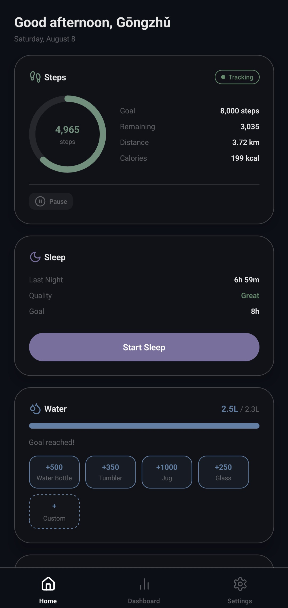
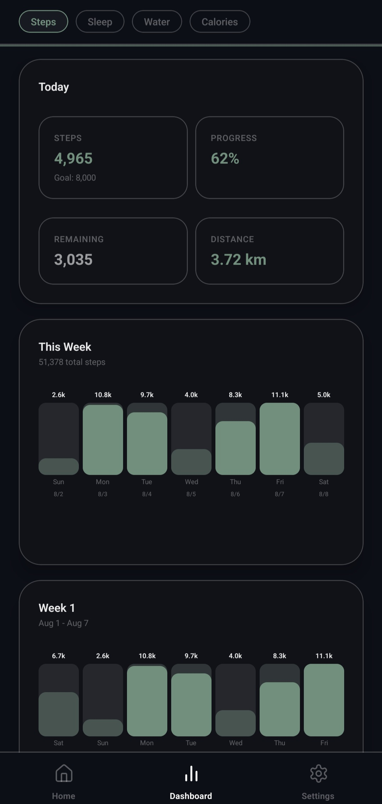
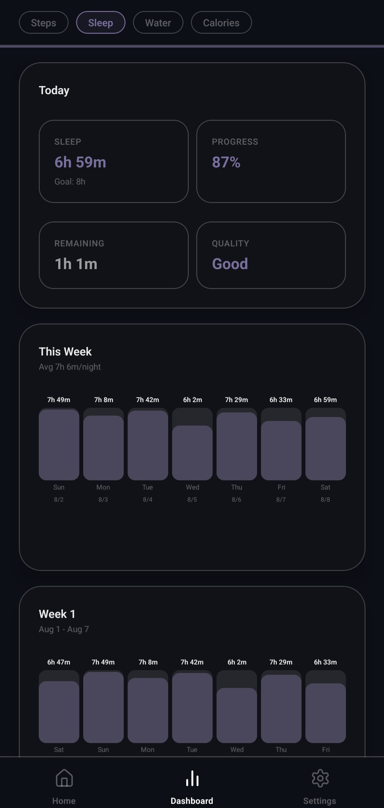
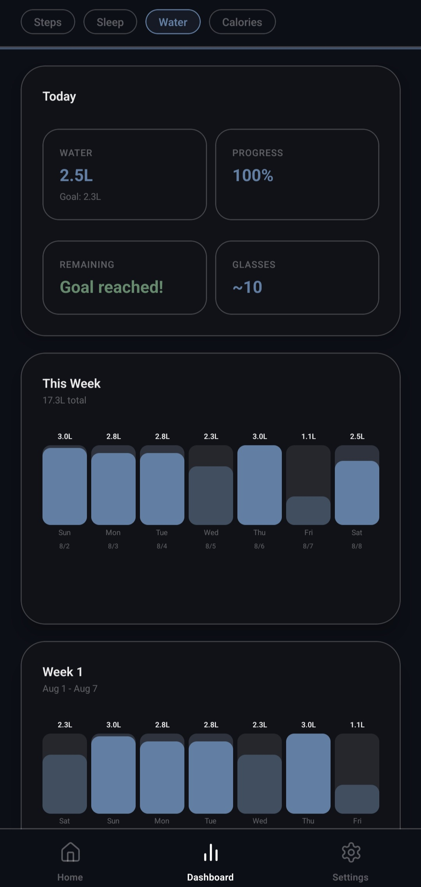
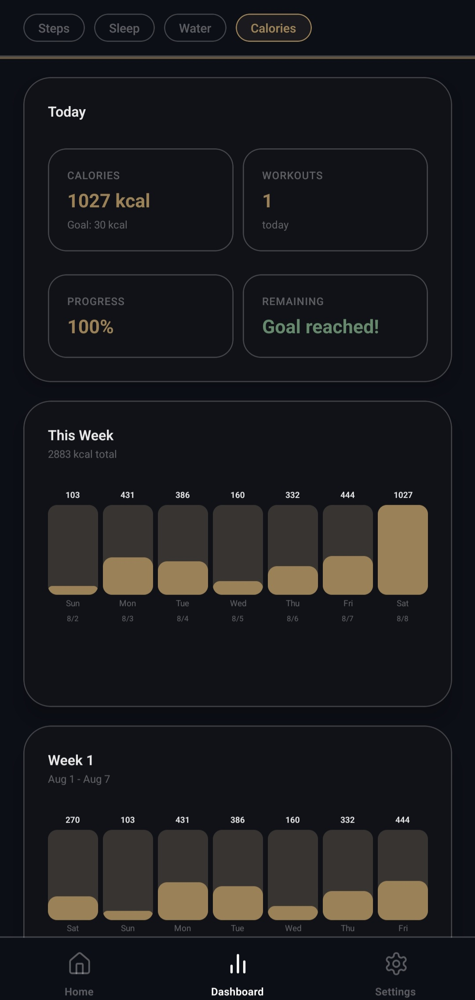
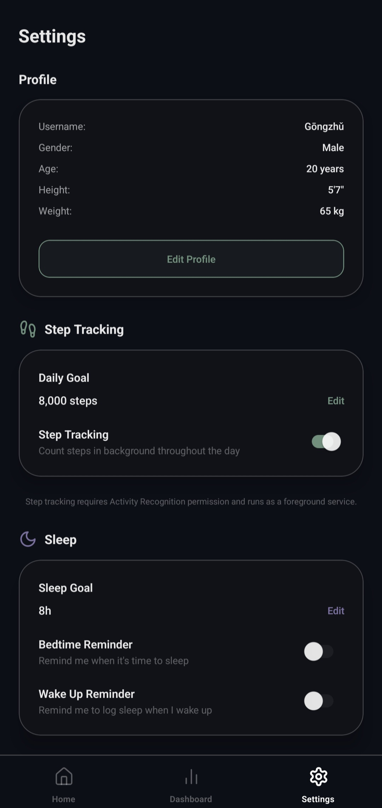
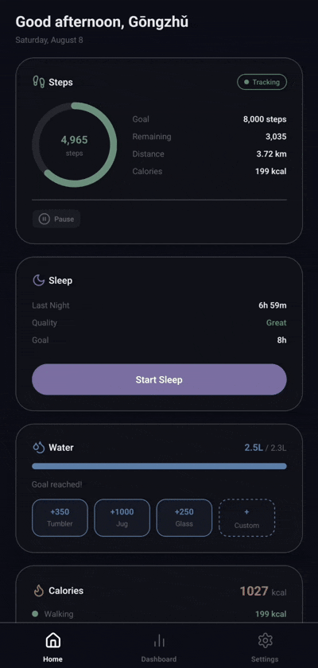

# Tracker

A personal health tracking app for Android. Track steps, sleep, water, calories, and habits — all offline.

> **Privacy First:** All data stays on your device. No account, no server, no internet required.

<br/>

## Why This App?

- **🔒 Complete Privacy** — Your data never leaves your phone
- **⚡ Fast & Lightweight** — No ads, no bloat, instant interactions
- **📊 Rich Visualizations** — Weekly and monthly graphs for all features
- **🎯 Goal Tracking** — Set and monitor daily goals with progress indicators
- **🔋 Battery Efficient** — Background step counting with minimal battery drain
- **📴 Fully Offline** — Works without internet connection

<br/>

## Screenshots

<p align="center">
  
  
  
  
  
  
  
</p>

<!-- If you have more screenshots, uncomment below:
<p align="center">
  
  
</p>
-->

## Demo

<p align="center">
  
</p>

<br/>

> **Note on step accuracy:** Step counts depend on your phone's hardware step counter sensor (`TYPE_STEP_COUNTER`). Flagship phones are very accurate. Budget phones may vary. The app reads directly from the sensor chip — it does not estimate steps in software.

## Features

| Feature | Details |
|---|---|
| **Steps** | Real-time background step counting with daily goal tracking. Tap any bar to inspect that day's details. |
| **Sleep** | Session-based sleep tracking with latency calculation, bedtime & wake reminders, and quality rating. |
| **Water** | Quick-log with customizable containers + custom ml input. Track daily hydration progress. |
| **Calories** | Automatic walking calories from steps + manual workout logging with intensity levels. |
| **ABC** | Daily habit limiter — track behaviors you want to reduce with configurable daily limits and summary notifications. |

**Dashboards:** Weekly bar charts, month-by-week breakdowns, and month selector with detailed statistics for all features.

<br/>

## Download

**Latest Release:** [Download APK](../../releases)

### Installation
1. Download the APK from [Releases](../../releases) page
2. On your Android device: **Settings → Apps → Special app access → Install unknown apps**
3. Allow your browser or file manager to install apps
4. Open the downloaded APK and install

No Google Play Store required.

<br/>

## How It Works

### Step Counting

The app uses Android's built-in `TYPE_STEP_COUNTER` hardware sensor — a dedicated chip in your phone's IMU that counts steps at the hardware level. The app simply reads this value; it does not process raw accelerometer data.

**Accuracy depends on:**
- **Phone hardware quality** — Flagship > mid-range > budget devices
- **Placement** — Pocket > hand > bag
- **Walking style** — Normal walking works best; shuffling may not register

**Important:** The hardware step counter resets on device reboot. The app automatically saves your count to the local database when:
- App goes to background
- Date changes (midnight)
- Every 5 minutes

### Data Storage

All data is stored in a local SQLite database on your device:
- Steps, sleep, water, calories, ABC logs
- User profile and preferences
- Daily, weekly, and monthly summaries

**No cloud sync** — Your data stays on your device and is never transmitted anywhere.

<br/>

## Tech Stack

- **React Native + Expo** (bare workflow for native module access)
- **TypeScript** — Type-safe development
- **Zustand** — Lightweight state management
- **expo-sqlite** — Local SQLite database
- **expo-notifications** — Reminders and daily summaries
- **Custom Native Module** — `StepCounterService.kt` foreground service for reliable background step counting

<br/>

## Building Locally

### Prerequisites

- Node.js 18+
- Android Studio with Android SDK
- Java 17
- Physical Android device (step sensor not available on emulators)

### Setup

```bash
git clone https://github.com/Sups11996/Tracker.git
cd Tracker/TrackerApp
npm install
```

### Development Build

```bash
npx expo run:android
```

This installs the debug APK on your connected device and starts the Metro bundler.

### Release Build (Unsigned)

For local testing without signing:

```bash
cd android
./gradlew assembleRelease
```

**Output:** `android/app/build/outputs/apk/release/app-release.apk`

**Install directly:**
```bash
adb install app/build/outputs/apk/release/app-release.apk
```

<br/>

## Permissions

The app requires the following permissions:

| Permission | Purpose |
|---|---|
| `ACTIVITY_RECOGNITION` | Read step counter hardware sensor |
| `FOREGROUND_SERVICE` + `FOREGROUND_SERVICE_HEALTH` | Background step counting service |
| `POST_NOTIFICATIONS` | Step count persistent notification + feature reminders |
| `REQUEST_IGNORE_BATTERY_OPTIMIZATIONS` | Prevent OS from stopping the step service |
| `RECEIVE_BOOT_COMPLETED` | Auto-restart step tracking after device reboot |

All permissions are used solely for core functionality. No data collection or tracking.

<br/>

## Project Structure

```
TrackerApp/
  src/
    features/          # Steps, Sleep, Water, Calories, ABC
      ├── home/        # Home screen with feature cards
      ├── dashboard/   # Unified dashboard with tab switching
      └── settings/    # App settings and data management
    stores/            # Zustand stores for each feature
    hooks/             # useAppHydration — background save, date change
    lib/               # SQLite schema, date utils, permissions, seed data
    navigation/        # Tab navigator
    components/        # Shared UI (Card, StatCard, BarChart, CustomAlert)
    constants/         # Design tokens (colors, spacing, typography)
  android/
    app/src/main/java/com/trackerapp/personal/
      StepCounterService.kt    # Foreground service for step counting
      StepServiceModule.kt     # React Native bridge
```

<br/>

## Contributing

Contributions are welcome! Feel free to:
- Report bugs
- Suggest features
- Submit pull requests

<br/>

## License

This project is open source and available under the [MIT License](LICENSE).

<br/>

---

